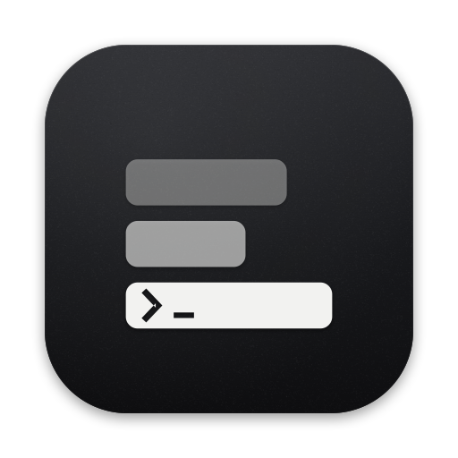
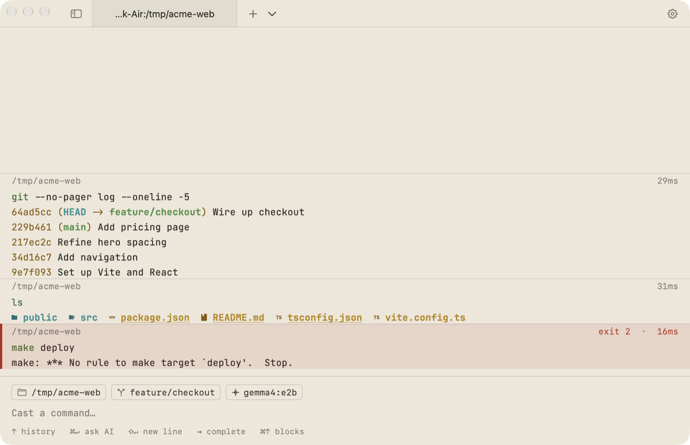
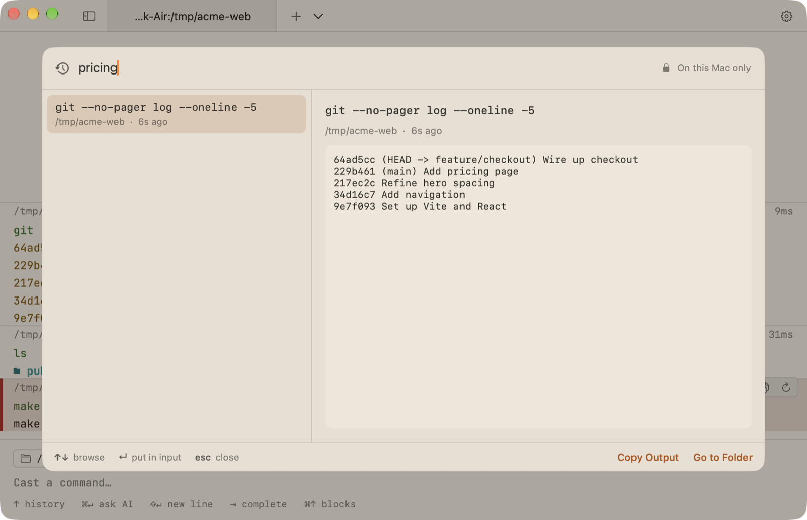
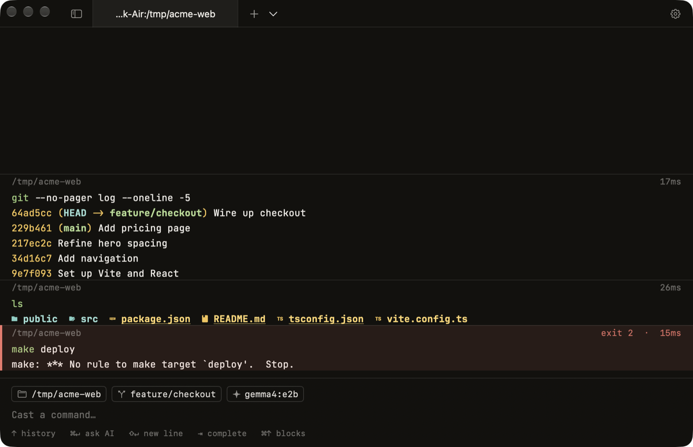
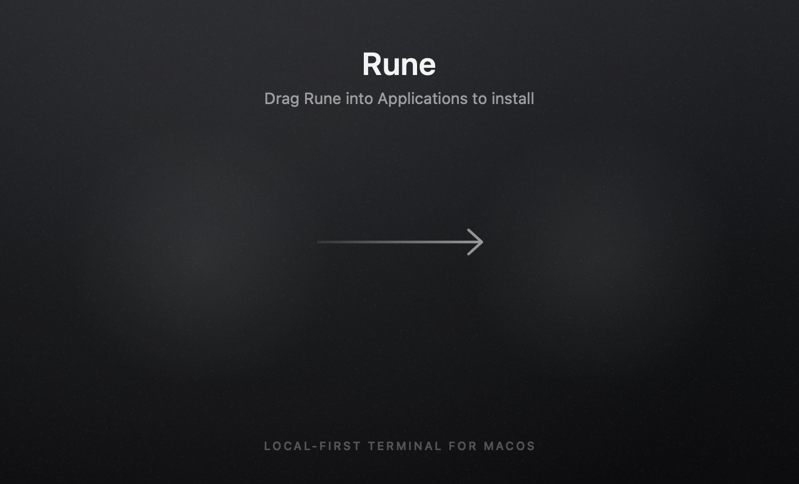

<div align="center">



# Rune

### The terminal, refined.

A native macOS terminal with command blocks, a modern input editor,
a private AI that runs entirely on your Mac, and a warm paper look that's easy on the eyes.

**[Download for macOS →](https://github.com/BryanParreira/Rune/releases/latest)**

<sub>Free · macOS 14 or later · Apple Silicon and Intel · Signed and notarized by Apple</sub>

<br><br>



</div>

<br>

## Built around how you actually work

**Every command is a block.**
Output is grouped with the command that produced it, its folder and how long it took. Failed commands stand out in red with their exit code. Hover to copy the command or its output, or run it again. Jump between blocks with ⌘↑ and ⌘↓.

**An input that feels like an editor.**
Type at the bottom, like a chat. Edit multi-line commands, accept suggestions from your history with →, and see typos in red before you press Enter. Tab completes subcommands and flags for git, docker, npm, brew, kubectl and more, with a short note on what each does, plus your npm scripts, Makefile targets and git branches.

**Recall: everything you've run, searchable.**
Press ⌃R to search every command *and its output* across all your sessions: "that docker command from last week", "the error that mentioned port 3000". It's stored only on your Mac, with secrets removed. Start a command with a space and it's never recorded.

<div align="center">

</div>

**Docs you can run.**
Open a README or any Markdown file and every shell snippet gets a Run button that puts the command in your terminal, ready for you to press Enter.

**A private AI, on your Mac.**
Press ⌘↵ to ask a question instead of running it. Rune answers with the context of where you are and what just happened, and suggested commands come back as cards you run with one click. Nothing runs until you say so. It works with any model you've installed in [Ollama](https://ollama.com). Your prompts never leave your machine.

**Your shell, untouched.**
Rune loads your own zsh setup exactly as it is: oh-my-zsh, Starship, plugins, aliases. It never edits your dotfiles.

**Everything is one keystroke away.**
Press ⌘P for the command palette: every action, your open tabs, recent folders, themes and your whole command history, found with a few letters.

**Split your workspace.**
⌘D splits a tab side by side and ⇧⌘D stacks it. Each pane is its own shell with its own input, and ⌥⌘ plus an arrow key moves between them.

**Workflows for the commands you repeat.**
Save a command once, with blanks like `git push {{remote}} {{branch}}`, then run it from the palette. Rune selects each blank for you to fill in and Tab moves to the next. Workflows live in your config file, so they travel with your sync folder. Commit a `.rune/workflows.json` to a repository and everyone on the team gets the same workflows there, no cloud account involved.

**Fast, and right where you left off.**
New tabs and splits open instantly, even with a heavy zsh setup, and huge outputs scroll by without slowing down. Quit or update, and your windows, tabs, splits and folders come back just as they were. Press ⌘F to search any output.

**Know when it's done.**
Start a long build, switch to something else, and Rune sends a notification when it finishes. Click it to jump straight back to that pane.

**Private by design.**
API keys and tokens in your output are masked on screen and never sent to AI. With one switch, `sudo` accepts Touch ID instead of your password.

**Easy on the eyes.**
Rune's Paper theme is a soft, warm beige with ink-colored text and a highlighter for selections, with handwritten touches here and there. Prefer the dark? Paper Night keeps the same warmth after sunset.

<div align="center">

</div>

**Files at a glance.**
Press ⌘B for a sidebar of the folder you're in, with git status colors and a project-wide filter. Click a file to read it right inside Rune, with syntax colors and line numbers.

**Thoughtful everywhere.**
Press ⌃\` in any app to bring Rune forward, and again to tuck it away. `imgcat photo.png` shows pictures right in the output. Full-screen apps like vim and htop take over cleanly. Closing a tab that's still running something asks first. Settings are searchable, and Rune updates itself quietly with verified releases.

<br>

<div align="center">

</div>

## Install

With [Homebrew](https://brew.sh):

```sh
brew install --cask bryanparreira/tap/rune
```

Or download it:

1. Download **Rune.dmg** from the [latest release](https://github.com/BryanParreira/Rune/releases/latest).
2. Open it and drag **Rune** into **Applications**.
3. Launch Rune. That's it: no account, no setup.

For AI features, install [Ollama](https://ollama.com/download) and pull a model, for example:

```sh
ollama pull qwen2.5-coder:3b
```

Rune finds your installed models automatically. You can choose one in Settings → AI.

## Keyboard

| Action | Shortcut |
|---|---|
| Run command | ↵ |
| New line | ⇧↵ |
| Ask AI · follow up | ⌘↵ |
| Accept suggestion | → |
| Command history | ↑ ↓ |
| Complete commands, flags, files | ⇥ |
| Recall: search past commands and output | ⌃R |
| Jump between blocks | ⌘↑ ⌘↓ |
| Search output · next · previous | ⌘F · ⌘G · ⇧⌘G |
| Clear screen | ⌘K |
| Show or hide Rune from any app | ⌃\` |
| Command palette | ⌘P |
| Files sidebar | ⌘B |
| Split right · split down | ⌘D · ⇧⌘D |
| Next pane · move between panes | ⌘] · ⌥⌘ arrows |
| New tab · close pane or tab | ⌘T · ⌘W |
| Settings | ⌘, |

## Privacy

Rune has no accounts, analytics, crash reporting or telemetry. Recall history, restored sessions and settings stay on your Mac, and secrets are removed before anything is stored or sent to AI. AI requests go only to the Ollama server on your Mac, or to one you explicitly configure, in which case Rune shows a warning. The only other network request is a daily update check that downloads a public feed and sends nothing about you. You can turn it off in Settings → About.

## Updates

Installed copies check for updates once a day and ask before installing. Every update is signed, and Rune verifies that signature before installing anything. You can also choose **Rune → Check for Updates…** at any time.

## For developers

Rune is a native Swift app (AppKit + SwiftUI) built on [SwiftTerm](https://github.com/migueldeicaza/SwiftTerm), with [Sparkle](https://sparkle-project.org) for updates. The source is published for transparency; it is proprietary and may not be copied or redistributed (see [LICENSE](LICENSE)). Build notes are in [INSTALL.md](INSTALL.md) and design notes in [docs/DESIGN.md](docs/DESIGN.md).

<br>

<div align="center">
<sub>Rune is free to use. © 2026 Bryan Bernardo Parreira. All rights reserved.<br>
Built with <a href="https://github.com/migueldeicaza/SwiftTerm">SwiftTerm</a> and <a href="https://sparkle-project.org">Sparkle</a>.</sub>
</div>
